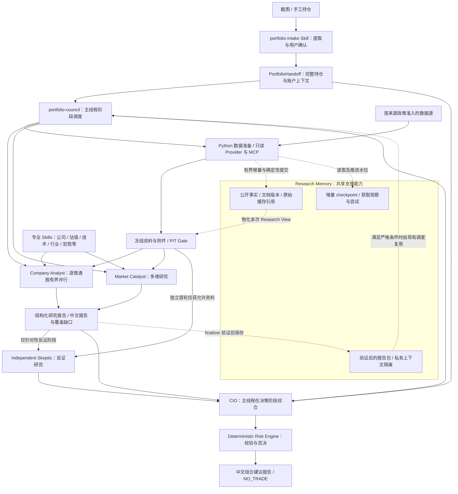

# Stock Agent 产品方向与架构

## 最终目标

构建一个运行在 Codex 上的 LLM-native 多 Agent 股票研究与组合决策 Agent Package。

用户主要输入真实持仓。

系统通过专业 Agent、Skill 和只读 Tool/MCP 获取并分析：

- 市场行情与市场状态
- 全球宏观
- 行业与热门板块
- 个股基本面、财报、估值和催化剂
- 研报与产业研究
- 资金流、杠杆和系统性风险
- 期权结构
- 基金持仓变化
- 政客交易与重要人物动态
- 新闻、社区和热门话题

专业 Agent 独立研究并提供证据、Thesis、反证和失效条件。

CIO 结合：

- 所有专业 Agent 的研究
- 当前持仓
- 组合暴露
- 风险约束

最终输出：
BUY / ADD / HOLD / REDUCE / EXIT / HEDGE / NO_TRADE
以及建议仓位、理由、风险、证据和失效条件。

## 产品架构与数据流

下图描述长期职责与信息流，不表示开发顺序或实现完成情况。实线表示主研究与决策关系，虚线表示共享存储交互；按获授权阶段执行所需子流程。具体契约见主规格，实施进度与验收记录见对应 OpenSpec Change。

Memory 不掌握调度权，也不要求所有入口一次迁移。各研究消费者按获授权 Capability 接入，fixture、预构建资料等入口保留各自明确的兼容契约。调度与 CIO 是主线程在不同阶段承担的职责，图中的两个节点不要求新增两个 Agent 或第二套编排器。研究阶段可以停止于研究报告，不自动推进到组合决策。

Skeptic 的报告输入边仅用于允许的针对性反证阶段；独立首轮不能自动接收 Analyst 结论。跨 Agent 历史查询须由各角色的工具权限和阶段契约限制，不能因共享存储而取消信息隔离。图中研究角色不穷举所有资产能力；新增资产或研究维度优先扩展已有 Skills 和工具，是否拆分 Agent 由职责和上下文隔离需求决定。

## 架构原则

LLM 是研究和判断主体。

Skill = 专业研究方法。
Agent = 使用 Skill + Tool 完成研究和判断。
Tool/MCP = 获取事实和执行确定性计算。
Python = 数据、计算、验证、Risk、持久化。

不得把投资研究逐步迁移成大型 Python 规则系统。

Research Memory = 跨运行保存、增量状态和受限历史读取，是共享支撑能力。事实、研究判断和实际市场结果分别保存；报告存入历史不代表判断成为事实。数据可复用与报告可复用分别判定，检查时间也不能冒充原报告的研究时间。

## 文档职责与任务选择

本文件维护长期产品目标、架构与取舍原则，不维护当前开发阶段或固定实施顺序。根 `AGENTS.md` 维护开发行为和职责；主规格维护已同步的行为契约；OpenSpec Change 维护对应需求、实施任务与验收记录。

当前做什么以用户明确指示及会话中已确认的任务为准。多个活跃 Change 只是并存的需求，不构成自动优先级。正常推进或归档 Change 无需修改根开发指令或本文件；只有长期产品方向或架构职责发生变化时才同步更新。

## 产品价值与后续方向

每项 Capability 应说明改善了哪项用户体验或研究结果，并给出可观察的完成结果：资料质量、研究深度、重复运行成本、等待时间或历史可读取性均可。无法对应当前授权目标的工程优化先保留为后续建议；已满足既定验收后停止，不将新建议自动升级为阻断项。

产品可演进方向包括研究与反证深化、组合决策、ETF/期权持仓研究、资金与所有权、全市场机会发现、社区与政客资料，以及 Performance/Benchmark、监测和 Reflection。该列表不表达优先级，也不自动授权实施；具体顺序按用户目标、现有能力和真实依赖确定。

验收样本规模与持仓数量上限分开，不能把有限测试样本数变成产品持仓限制。历史时间字段与研究报告为回溯提供资料基础，但不代表已具备历史重放、绩效计算或回测能力。来源覆盖、研究充分性与执行成功分别依据实际产物判断，不能把接口存在视为资料齐全。

工程基础设施只做到足以支持当前授权产品能力；新增研究职责优先复用已有 Agent 与 Skills，确有独立判断或上下文隔离需求时再拆分 Agent。
