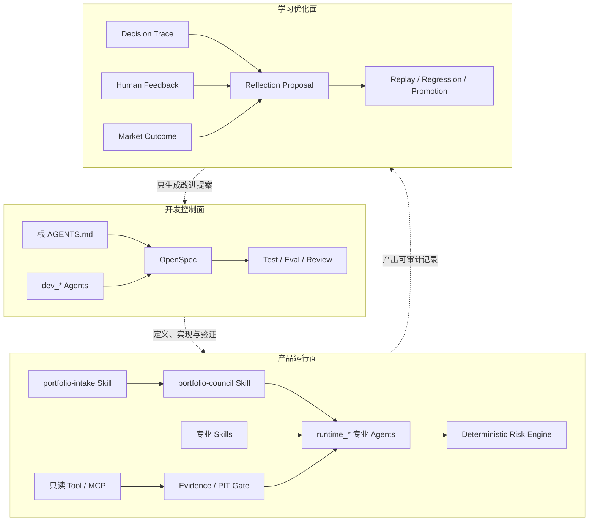
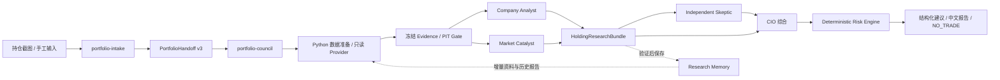

# Stock Agent

Stock Agent 是一个运行在 Codex 上、面向真实持仓研究的 **LLM-native 多 Agent 投研与组合决策系统**。

它的目标不是把传统后端接上几个 Prompt，也不是用 Python 规则替代投资判断，而是让专业 Agent 在可追溯证据和明确职责边界内完成研究、反证与综合，再由确定性程序负责数据处理、契约校验和硬风险否决。

> 当前项目仅提供研究建议，不连接券商、不创建订单、不执行真实交易。

## 系统目标

用户可以从持仓截图或手工持仓开始，逐步得到：

- 已确认且不丢失资产的结构化组合输入；
- 对普通股持仓的公司、估值、技术、行业、宏观、期权、所有权和公开研报研究；
- 带有来源、时间、证据缺口、反证和失效条件的中文报告；
- 在完整委员会阶段，由 CIO 综合专业研究与组合暴露；
- 经 deterministic Risk Engine 校验或否决的结构化建议；
- 数据不足、过期、矛盾或无法安全决策时的 `NO_TRADE`。

长期产品方向见 [PRODUCT.md](PRODUCT.md)。本 README 负责介绍项目，不写死当前开发优先级；当前任务、范围和完成状态以用户明确指令及对应 OpenSpec Change 为准。

## 分层架构

项目明确区分三个平面，避免开发流程、产品研究和学习优化互相污染。



### 1. 开发控制面：外层开发 Agent

外层 Agent 负责构建和维护系统，不参与投资决策。

主要组成：

- [AGENTS.md](AGENTS.md)：开发行为、职责边界、完成标准与安全规则；
- `.codex/agents/dev_*.toml`：架构、契约、评测和独立复核等开发角色；
- `openspec/`：需求、设计、规格、任务、验收与归档记录；
- `tests/`、`evals/`、`reviews/`：确定性测试、运行评测和审查证据；
- [开发流程](docs/development/workflow.md)：开发、验收、归档和 Git 流程；
- [开发环境](docs/development/environment.md)：路径、权限、配置和启动排障。

外层开发 Agent 遵循以下原则：

- 不因读取产品配置而自动担任 CIO；
- 行为变更先由 OpenSpec 明确需求和边界，再进入实现；
- 已获授权后持续完成范围内工作，只有真实阻断或人工批准点才暂停；
- 普通开发采用聚焦验证，不把发布级 Gate 作为每一步的前置条件；
- 不为了工程完整感扩建与当前产品目标无关的平台能力。

### 2. 产品运行面：内层产品 Agent Package

内层是用户真正调用的研究系统，入口和运行规则位于 `product/`。

| 组件 | 职责 | 边界 |
| --- | --- | --- |
| `portfolio-intake` Skill | 从截图或手工文字提取普通股、ETF、上市期权、现金和账户信息，生成经用户确认的 `PortfolioHandoff v3` | 不研究证券，不输出买卖动作，不自动启动委员会 |
| Codex 主线程 / `portfolio-council` | 根据明确阶段组织资料准备、专业研究和结果归集；进入决策阶段时担任 CIO | 不另建 Python LLM 编排后端，不绕过阶段契约 |
| `runtime_company_analyst` | 逐公司研究商业质量、财务、估值、催化剂、风险和 Thesis | 不独立决定完整组合动作 |
| `runtime_market_catalyst` | 处理技术结构、同行、宏观、事件、期权、所有权和研报等多维资料 | 当前多维研究阶段停止于研究包，不自动进入 CIO |
| `runtime_skeptic` | 独立寻找反证、证据冲突和 Thesis 失效条件 | 独立首轮不得预先读取 Analyst 结论 |
| `runtime_cio` | 综合结构化专业报告、组合上下文与风险约束 | 仅在获授权的完整决策阶段运行 |
| deterministic Risk Engine | 校验仓位、集中度、执行字段及硬风险政策，并可否决建议 | 不生成主观投资 Thesis，否决不可被 LLM 覆盖 |

产品运行规则见 [product/AGENTS.md](product/AGENTS.md)。

### 3. 学习优化面

学习优化面消费真实运行留下的 Trace、反馈和市场结果，用于复核系统是否在变好，而不是在产品运行时直接重写自己。

当前基础包括：

- Decision Trace 与版本、Prompt、Skill、Evidence、输入输出 hash 的关联；
- Artifact Replay 与 Execution Replay；
- Runtime Eval、固定 Regression Set 和 Ablation；
- 候选版本 Promotion Gate；
- Human Feedback、Market Outcome 和 Reflection Proposal 的扩展位置。

初期自我优化只能生成 `Improvement Proposal`。任何 Skill、Agent、Schema、Risk Policy 或生产版本变化，仍需进入开发控制面审查和人工批准。

## 产品数据流



这张图表达长期完整链路，不代表每次运行都必须经过所有节点：

- Intake 可以单独结束于已确认的 `PortfolioHandoff`；
- 普通股研究可以结束于 `EquityResearchReport`；
- 多维研究可以结束于 `HoldingResearchBundle`；
- 只有明确进入完整决策阶段，才会调用 Skeptic、CIO 和 Risk Engine；
- 数据不足或资产能力未覆盖时必须显式保留缺口，必要时停止或输出 `NO_TRADE`。

## 核心设计理念

### LLM 与确定性程序各司其职

| LLM / Agent 负责 | Python / Tool / MCP 负责 |
| --- | --- |
| 研究与解释 | 数据获取和标准化 |
| Thesis 与反证 | 数学计算和持仓核算 |
| 证据冲突分析 | Schema 与 Evidence Closure 校验 |
| 不确定性和失效条件 | PIT 过滤、hash、版本和存储 |
| 多角色观点综合 | 硬风险约束和确定性否决 |

禁止把投资判断迁移为大型 `if/else`、评分表或伪装成“智能”的规则引擎。

### Capability-first，而不是 Agent-first

项目不会先创建大量空 Agent。一个 Capability 至少要形成：

```text
Input → Tool/Data → Skill/Reasoning → Structured Output → Eval
```

只有存在独立职责、上下文隔离或判断方法时才拆分 Agent；可复用的方法沉淀为 Skill，确定性动作沉淀为 Tool/Python。

### Evidence-first 与 point-in-time

所有承载事实的契约都必须包含：

- `source_id`
- `as_of`
- `retrieved_at`

进入 Agent 上下文前必须经过 point-in-time 过滤。事实、推断、观点、冲突和缺口分开表达；不存在的 `evidence_id`、未来信息或无法验证的引用必须 fail closed。

### Research Memory 是共享能力，不是新 Agent

跨运行持久化、增量 checkpoint、缓存、报告保存和历史读取属于确定性基础能力。Research Memory：

- 不拥有调度权；
- 不替代 Company Analyst、Skeptic 或 CIO；
- 不把历史判断伪装成事实；
- 不因读取时间更新而改写原报告的研究截止时间；
- 仅在输入、资料、版本和时效条件等价时复用报告。

### 安全失败优先

数据不足、过期、冲突、资产能力缺失或风险校验失败时，系统可以停止、保留覆盖缺口或返回 `NO_TRADE`。它不会为了生成看似完整的报告而编造数据，也不会绕过 Risk Engine。

## 当前进展

以下是截至 2026-09-17 的能力快照，不表示固定开发顺序。

### 已建立

- **统一持仓输入**：支持截图和手工输入，保留普通股、ETF、上市期权、现金及账户上下文，并由用户一次确认后生成 `PortfolioHandoff v3`。
- **普通股持仓研究**：可对多个普通股使用同一 Company Analyst 角色进行有界并行研究，生成结构化结果和中文报告。
- **多维研究资料**：已覆盖公司基本面、估值、技术结构、同行比较、宏观、事件、期权市场结构、所有权披露和公开研报等维度；不可得资料会留下明确缺口。
- **只读真实数据基础**：已建立 SEC、Yahoo、NASDAQ、Moomoo 及公开补充来源的只读适配、缓存、标准化和来源血缘基础；实际可用性仍受来源权限、时效和网络条件约束。
- **证据与时间边界**：已具备 PIT Gate、Evidence Closure、三时间字段和悬空引用拒绝。
- **Fixture 委员会闭环**：Company Analyst、Independent Skeptic、CIO 和 deterministic Risk Engine 已在受控 fixture 场景形成完整链路。
- **运行审计基础**：已建立 Trace、Replay、Runtime Eval、Regression、Ablation 和 Promotion Gate；这些能力只在明确验收或晋升任务中运行。
- **估值与报告表达**：已建立估值历史、确定性计算和研究报告图表产物。

### 正在建设

- **Persistent Company Research Memory**：把分散在单次运行和请求缓存中的个股资料、增量水位、冻结研究视图及已验证报告升级为跨运行、可增量、可审计的共享 Research Memory。

该项的具体范围和实时状态由 `openspec/changes/establish-persistent-company-research-memory/` 管理；它是当前存在的 Change，不代表 README 为后续工作设定永久优先级。

### 尚未宣称完成

- 当前真实持仓研究资料到 Skeptic、CIO、Risk 的完整 live 决策闭环；
- ETF 和持仓期权的独立研究能力与完整多资产 Risk Policy；
- 全市场机会发现和动态 Agent 路由；
- 组合绩效、Benchmark、历史回测和持续监测；
- 基于真实结果的 Reflection 与版本自动晋升；
- 任何券商连接、订单路由或自动交易。

“接口存在”不等于“资料充分”，“fixture 通过”不等于“live 产品完成”，“Change 完成”也不等于“候选版本已晋升”。

## 目录结构

```text
stock_agent/
├── AGENTS.md                  # 外层开发 Agent 的根规则
├── PRODUCT.md                 # 长期产品目标、架构和取舍原则
├── README.md                  # 项目总览与入口
├── .codex/agents/             # 开发控制面 Agent 定义
├── openspec/
│   ├── specs/                 # 已同步的主规格
│   └── changes/               # 活跃与归档 Change
├── product/
│   ├── AGENTS.md              # 产品运行规则
│   ├── .codex/agents/         # runtime_* 专业 Agent 定义
│   ├── skills/                # 产品 Skills
│   ├── mcp/                   # 只读数据与计算工具
│   ├── runtime/               # 调度接缝、验证、Trace、Replay、Eval
│   ├── deterministic/         # 数学、组合与确定性风险逻辑
│   ├── evidence_store/        # Evidence 存储基础
│   ├── contracts/             # 结构化契约
│   └── schemas/               # JSON Schema
├── learning/                  # 学习优化与提案边界
├── tests/                     # 确定性测试
├── evals/                     # Eval、Regression、Ablation、Promotion 资产
├── reviews/                   # 独立复核与运行证据
├── docs/                      # 产品、开发和数据文档
└── scripts/                   # 开发工具及宿主产品 launcher
```

## 使用入口

### 面向用户：从持仓开始

在 Codex 中提供持仓截图或手工持仓并调用 `portfolio-intake`。确认生成的 `PortfolioHandoff v3` 后，再根据需要调用 `portfolio-council` 的指定阶段，例如普通股研究或多维持仓研究。

Intake 不会自动启动研究，研究阶段也不会未经授权自动推进到 CIO 决策。

### 面向开发者：修改系统

环境要求：

- Python 3.11+
- 可用的 Codex 桌面端或 CLI
- 仅在真实数据任务中安装可选 live 依赖

```bash
# 基础开发安装
python3 -m pip install -e .

# 需要真实只读数据适配时
python3 -m pip install -e '.[live]'

# 查看当前 OpenSpec Change
openspec list

# 严格校验 OpenSpec
openspec validate --all --strict

# 运行确定性测试
python3 -m unittest discover -s tests
```

开始改动前先阅读 [AGENTS.md](AGENTS.md)。涉及产品方向或 Capability 取舍时再阅读 [PRODUCT.md](PRODUCT.md)；涉及产品运行契约时阅读 [product/AGENTS.md](product/AGENTS.md)。不要把所有专项文档都作为每次任务的固定前置。

### 本机研究资料浏览器

`add-local-research-browser` 提供一个只读网页，用于浏览 Research Memory 中已经保存的 Company 事实、View、披露事件和研究报告，以及显式配置的 Macro、Market 冻结产物。它不会联网补采、调用模型、启动研究调度或修改持久化数据。

先检查 Memory 是否可读：

```bash
python3 scripts/research-browser.py \
  --memory-root "/path/to/existing/research-memory" \
  --check
```

只查看 Company 持久化资料时，直接启动：

```bash
python3 scripts/research-browser.py \
  --memory-root "/path/to/existing/research-memory" \
  --port 8765
```

如果还要浏览已有 Macro、Market 或补充研究产物，可追加一个或多个冻结运行目录：

```bash
python3 scripts/research-browser.py \
  --memory-root "/path/to/existing/research-memory" \
  --run-dir "/path/to/an/exact/frozen-run" \
  --run-root "/path/to/a/run-root" \
  --port 8765
```

启动后打开 `http://127.0.0.1:8765/`。服务只监听本机；在启动它的 Terminal 中按 `Ctrl-C` 停止。

- `--memory-root` 必须指向已经存在的 Research Memory；缺库不会自动创建或迁移。
- `--run-dir` 精确读取一个冻结运行目录，可重复指定。
- `--run-root` 只发现根目录下直属且包含已知 manifest 的运行目录，可重复指定，不递归扫描其他位置。
- 页面中的“重新扫描已配置目录”只重读本地文件，不会刷新外部数据。
- `AVAILABLE` 表示保存产物存在且版本绑定闭合；`BINDING_FAILED` 表示候选产物与当前 security/run/cutoff/Evidence 不匹配；`NOT_GENERATED` 只表示没有可展示的保存产物，不代表现实中不存在相关事件或观点。

完整的页面含义、支持格式、View 引用诊断和离线修复方式见 [本机研究资料浏览器说明](docs/product/local-research-browser.md)。

### 真实产品运行

真实 Smoke 和 Execution Replay 通过宿主 Terminal 的统一 launcher 运行：

```bash
bash scripts/run-product-smoke.sh --help
```

该入口负责真实 Codex 子进程、运行目录和宿主网络环境的接缝。详细命令、准备步骤和产物要求见 [运行与重放手册](reviews/runtime/runtime-replay-eval-runbook.md)。不要把内部 `python3 -m product.runtime.cli` 当作另一套产品编排入口。

## 文档导航

| 想了解的内容 | 文档 |
| --- | --- |
| 长期产品目标与完整架构 | [PRODUCT.md](PRODUCT.md) |
| 开发 Agent 的行为和安全边界 | [AGENTS.md](AGENTS.md) |
| 产品运行 Agent 的职责和阶段边界 | [product/AGENTS.md](product/AGENTS.md) |
| 持仓输入 | [docs/product/portfolio-intake.md](docs/product/portfolio-intake.md) |
| 普通股持仓分析 | [docs/product/common-stock-holding-analysis.md](docs/product/common-stock-holding-analysis.md) |
| 多维持仓研究 | [docs/product/multi-dimensional-holding-research.md](docs/product/multi-dimensional-holding-research.md) |
| 本机 Research Memory 网页浏览 | [docs/product/local-research-browser.md](docs/product/local-research-browser.md) |
| 开发与归档流程 | [docs/development/workflow.md](docs/development/workflow.md) |
| 环境和启动排障 | [docs/development/environment.md](docs/development/environment.md) |
| Runtime Replay / Eval | [reviews/runtime/runtime-replay-eval-runbook.md](reviews/runtime/runtime-replay-eval-runbook.md) |
| 已生效的系统行为契约 | `openspec/specs/` |
| 当前需求、设计、任务和验收 | `openspec/changes/<change-name>/` |

## 隐私与安全

- 真实持仓、账户截图、凭据、私人报告包、数据库和会话状态不得提交 Git；
- Provider 和 MCP 只允许只读访问，不索取或修改券商账户；
- 最终建议必须声明 `advisory_only: true`；
- Risk Engine 的否决不可被 Agent 覆盖；
- 任何自动修改 Skill、Agent、Schema、Risk Policy 或生产版本的行为都不被允许；
- 本项目输出不构成投资、法律或税务建议，用户需自行判断并承担决策责任。

## 项目状态说明

本项目仍在持续演进。README 中的“当前进展”用于帮助理解系统现状，不是验收证据；准确行为以主规格和实际运行产物为准，实施完成度以对应 OpenSpec Tasks、测试和人工批准记录为准。
